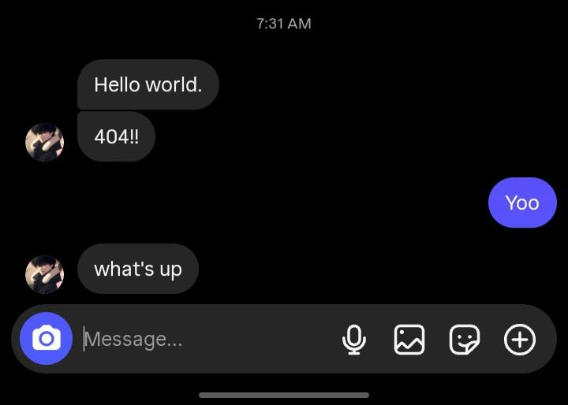

# QA Case Study: Instagram Web Chronological Message Inversion

## 📋 Overview
* **Target Surface:** Instagram Direct Messages (DMs)
* **Environment:** Desktop Web (Google Chrome / Windows)
* **Type:** Functional / UI Layer Chronological Sorting Defect
* **Status:** Submitted to Meta Engineering Channels

---

## 🔍 Bug Diagnostics

### Problem Statement
During real-time chat concurrency on the desktop web client, outbound messages fail to append sequentially to the bottom of the DOM layout. Instead, they dynamically float above the most recent incoming message container. 

### Cross-Device & State Behavior
1. **Mobile Alignment:** Testing on the recipient's mobile application confirmed that the database stores and sequences the chat perfectly. The bug is strictly a client-side presentation layer failure on Web.
2. **State Persistence:** Performing a hard browser refresh resolves the layout, proving the server-side database array is correct, but the real-time client-side state management is missing an active chronological sorting function prior to DOM injection.

---

## 🛠️ Reproduction Protocol

### Steps to Reproduce:
1. Initialize an active chat session on `instagram.com` via Google Chrome.
2. Await an incoming real-time payload (text, image, or attachment).
3. Immediately input a response and commit it (`Enter`).
4. Observe the layout hierarchy of the generated message container.

### Expected Result:
Outbound message dynamically appends below the incoming message timeline block.

### Actual Result:
Outbound message node visually bypasses the incoming node, displaying out of chronological order.

<figure>
  
  <figcaption><i>Figure 1: Mobile parity baseline verifying expected behavior. The mobile UI correctly renders the concurrent real-time exchange in perfect chronological order, confirming the backend database sequencing is correct and isolating the failure strictly to the desktop web client.</i></figcaption>
</figure>

<figure>
  
  <figcaption><i>Figure 2: Active defect state captured on the desktop web client. Immediately following a real-time incoming payload from the mobile user, the web client's outbound response dynamically appends above the incoming message container, breaking sequential text flow and violating chronological layout logic.</i></figcaption>
</figure>

<figure>
  
  <figcaption><i>Figure 3: Post-refresh state alignment. Forcing a hard browser refresh triggers a fresh server-side data pull, restores the correct chronological order. This confirms that database state-persistence is functioning perfectly, validating that the bug is entirely constrained to the client-side real-time DOM-injection layer.</i></figcaption>
</figure>

---

## 📈 Impact Evaluation
* **Severity:** Medium-High
* **UX Friction:** Severe. Real-time timeline inversion damages conversational context, potentially causing severe text misinterpretation in critical, time-sensitive personal or professional communications.
